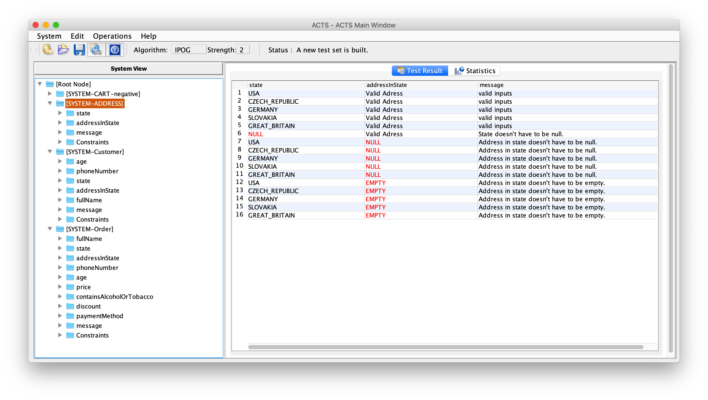
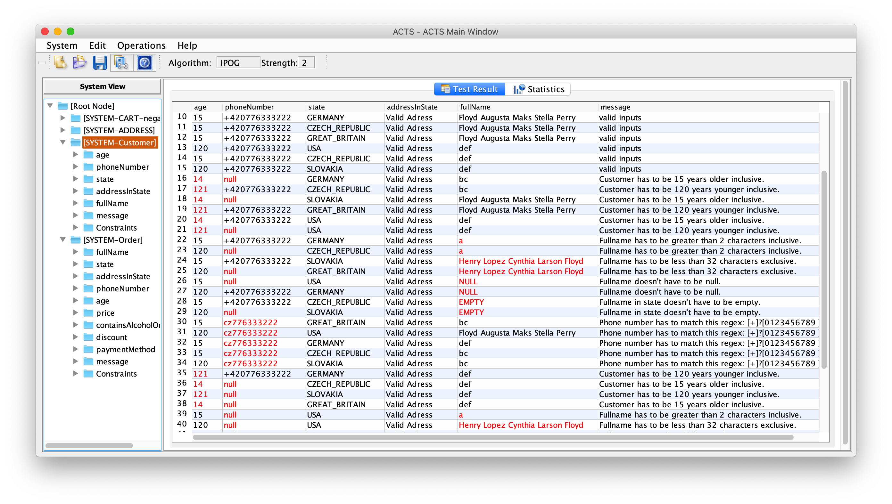
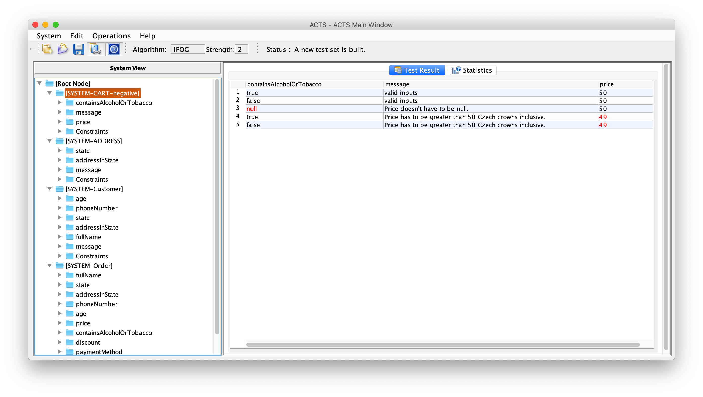
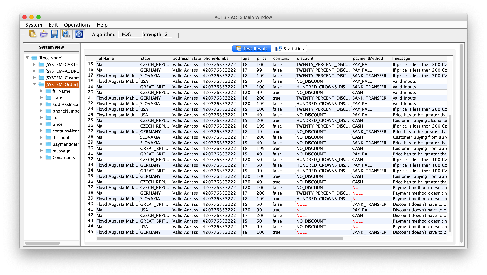
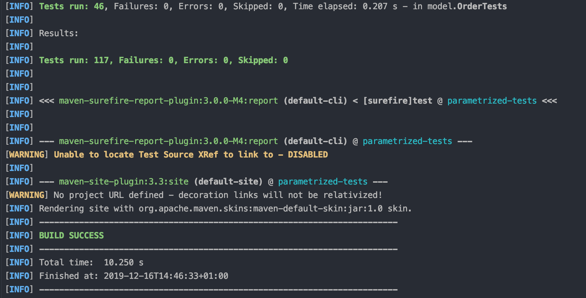
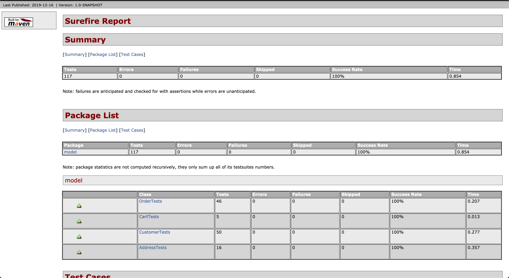

# Homework 3:
**Topic: JUnit (advanced features)**
**Task:**
Create parameterized tests of an E-shop backend (SUT) using JUnit 5 and data combinations generated using the ACTS tool. 

_E-shop sources:_ https://gitlab.fel.cvut.cz/rechtva1/sqa_parametrized_tests

_ACTS tool:_ https://drive.google.com/file/d/1I9w4NhGI3HaMtncMZadYdDsaKAYAdKAt/view

**HOMEWORK STEPS:**
1. Find the equivalence classes for variables in the SUT
2. Model the SUT using the ACTS application
3. Generate the 2-way test combinations
4. Use generated combinations to create the parameterized tests
5. Generate the surefire reports

- First of all the "bugs" in code were fixed, like incorrect boundary values for variables. 
tests run with command. Then equivalence classes for each variable were founded:
    -   `fullname` {0},[1;2],[2;32),[32;..)
    -   `price` (0;50),[50;100),[100,200),[200,..)
    -   `age` (0;15),[15;18),[18,120],(121,..)
- Next 4 SUT models were created in ACTS

- generated csvfiles are in `src/test/resources` folder
- 4 tests were developed: `AddressTests`, `CartTests`, `CustomerTests`, `OrderTests`
- Surefire report regenrated:
`mvn clean surefire-report:report site -DgenerateReports=false` 

---
**(!)NOTE Downloading the https://gitlab.fel.cvut.cz/rechtva1/sqa_parametrized_tests you will get the problem with running all tests and generating report using maven.**
When you try to run your test from your favourite IDE, your tests will be executed normally.

(!) When you run them using maven, your tests will not be executed and your output will look like below.
You need to do couple more things to make it run from commandline.

Maven Surefire and Maven Failsafe provide native support for executing tests on the JUnit Platform.
junit-jupiter-engine dependency required for maven surefire to run any tests

To deal with it just follow it: https://java-focus.com/parameterizedtest-junit-5/